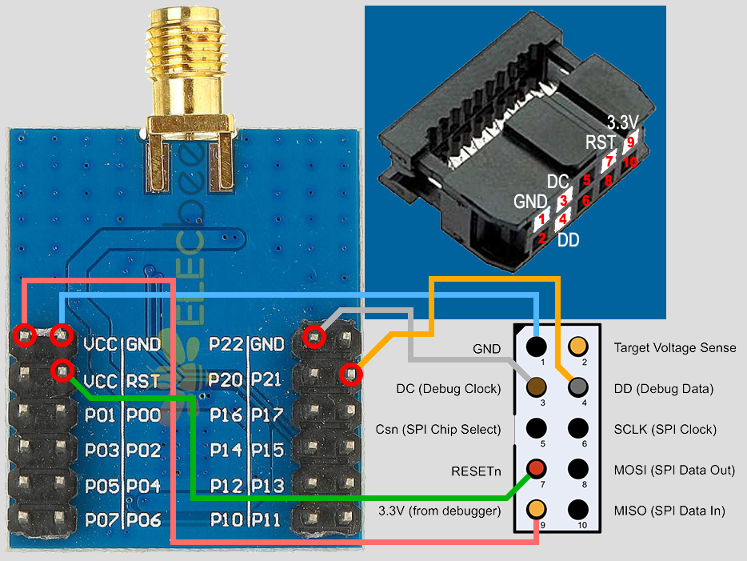
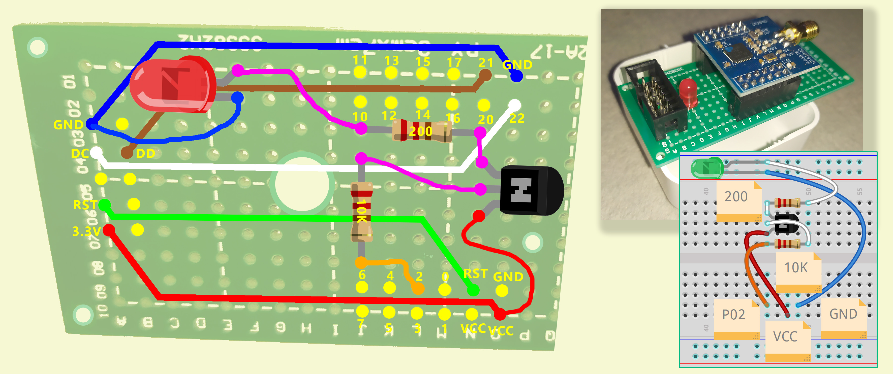
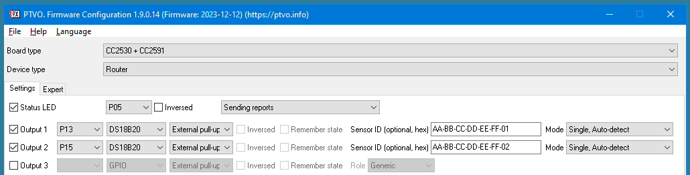
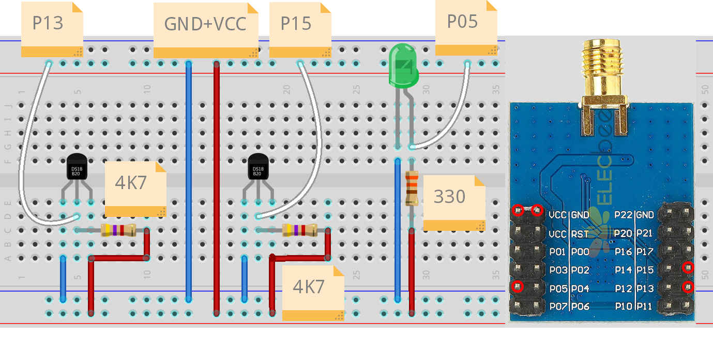

URL: https://github.com/mozolin/CC2530_Zigbee  
# Example: BMX280 sensors with CC2530 (PTVO Firmware Config & SmartRF Flash Programmer)  

Official PTVO docs: [How to select and flash CC2530](https://ptvo.info/how-to-select-and-flash-cc2530-144/)
  
1) connect CC2530 to SmartRF04EB (CC-Debugger)  

2) connect SmartRF04EB (CC-Debugger) to computer  
3) make .HEX-file with "PTVO. Firmware configuration" software  

4) flash (upload) firmware (.HEX-file) with "TI SmartRF Flash Programmer V1"  
   (V2 does not work with CC2530)  
5) pair CC2530 with Zigbee2MQTT  
  
СС2530 can be re-paired:  
1) power on  
2) wait 2 seconds  
3) power off  
4) repeat above steps 2 further times
5) power on and wait for it to join your network
  

